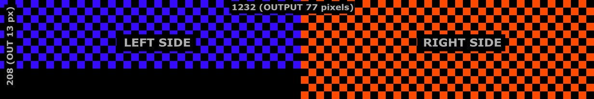
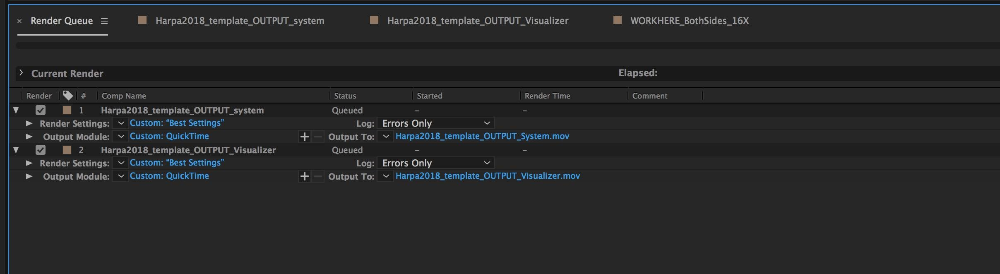
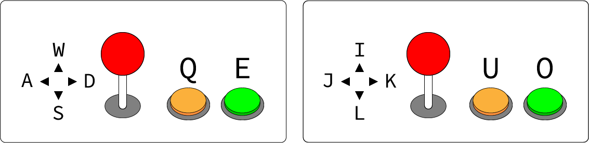

# Creators Kit

This kit contains documents and templates for different types of software. <a href="https://join.slack.com/t/tiny-massive/shared_invite/enQtNDY1MjQwMjY4NzY4LTlhZDgxZTJmZDIxOTQ0MDY5Y2I1MWQ0MDYyMjEyMmVlNGFiNDNhMTlmMmEyNzEwMTI3YWRjNzJhMzkzZGIzNjk">Join our Slack</a> for questions and creative feedback.

## Video Visualiser

[Visualiser](../visualiser/)

Upload your video and get an understanding of what it would look like on the building!

## Processing

[TM Processing Template](https://github.com/regisfrias/tinymassive-pde-template)

## Unity

**Simple** ([tutorial](https://www.youtube.com/watch?v=A3irySxcXY4))

[TM Unity Simple Template + Visualiser (Mac only)](TMApps.zip)

[Syphoner](http://www.sigmasix.ch/syphoner/)

**Advanced** ([tutorial](https://docs.google.com/document/d/14lVTT5Eh0mVbZN7ukxQ_8zATk2JOuJBczsSjYwUdkrs))

[TM Unity Advanced Template (Mac & Windows)](TMAdvTemplate.zip)

## TouchDesigner

[TouchDesignerHarpaTemplate](TouchDesigner/HarpaTemplate.toe)

## After Effects

[AfterEffectsHarpaTemplate](AfterEffects/HarpaTemplate.zip)

This project is made on After Effects CC 2017 and comes with two types of compositions; WORKING and OUTPUT. The pixel space of the Working compositions is 16x larger than the actual output. This allows you to create on a reasonable size.



**WORKING COMP**


**OUTPUT COMP**


Once you are done with Working on the creative side, you can output your work from two options:

1. Harpa2018_template_OUTPUT_Visualizer (this render can be used for the online visualiser)
2. Harpa2018_template_OUTPUT_System (this is the render for the system, your delivery format)



I recommend that you duplicate the render settings for each output. And voila!

## Controls

We will provide visitors with an arcade like control setup with 2 joysticks and 4 arcade buttons. These will be mapped like keyboard inputs, so if you want to include any of these controls into your project please refer to the diagram below. Remember that you can choose to not use these at all, or just use a few, up to you!



```
W, A, S, D (joystick 1 up/left/down/right)
I, J, K, L (joystick 2 up/left/down/right)
Q, E (2 generic buttons mounted next to joystick 1 )
U, O (2 generic buttons mounted next to joystick 2 )
0 (Important: this button (numpad 0) should reset the game state.)
```

## More…

[HarpaFacade](HarpaFacade.ai)

[HarpaFacadeA](HarpaFacadeA.pdf)

[HarpaFacadeB](HarpaFacadeB.pdf)

[GluggarVinnuskjal](GluggarVinnuskjal.xlsx)

These documents are provided for the curious and are intended to show exactly how the lights are laid out on the buildings.

**PAY NO ATTENTION TO THE CODES ON THE DIAGRAMS:** They are for us to worry about, and some of them are wrong anyway.

**ALSO NOTE:**Our 77x13 mapping does miss some small rows, and one or two individual lights at the edges. They will remain black.

It is worth taking note of how the different "pixels" of the facade are arranged relative to each other, i.e. they are not in a regular straight grid.

If in doubt, stick to the 77 x 13 grid.

In detail, from your app's perspective:

```
0,0 is the top-left light on the small facade
37,8 is the right-hand light on the lowest row on the small facade. (E3/S12/U5/46 on the overview cableing south facade small-a.pdf document)
38,0 is unmapped (because the light there doesn't exist)
38,1 is the top light on the left-most row on the large facade (E2/S10/U4/151 on the overview cableing facade south large-b.pdf document)
76,12 is actually unmapped (because the light there doesn't exist)
76,10 is the bottom-right light on the second-to-last row (E1/S1/U1/13 on overview cableing facade south large-b.pdf document)
```
